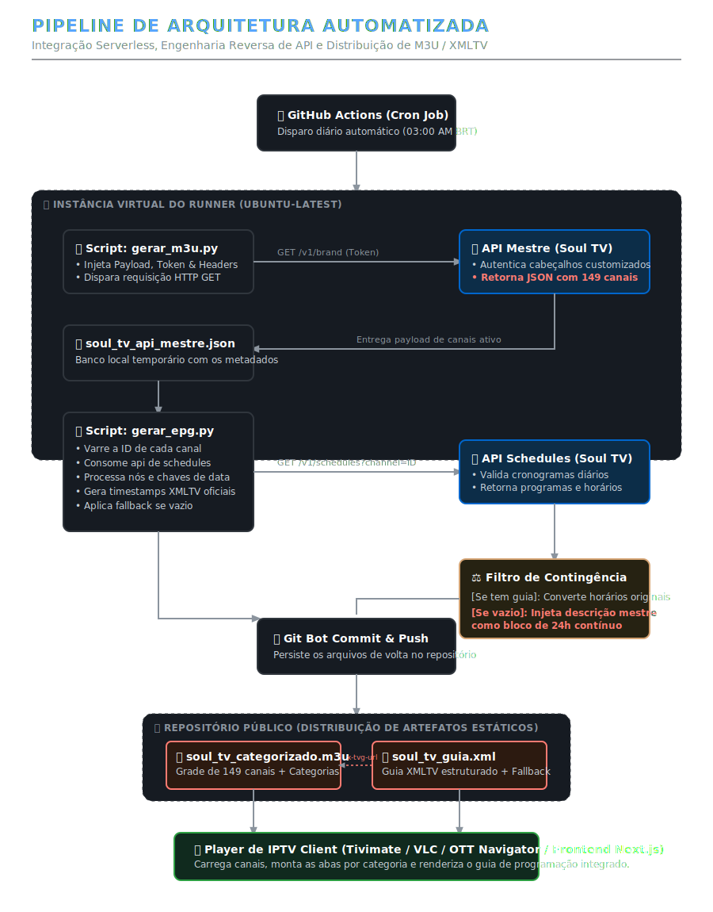

# 📺 Soul TV API Integration & Automated EPG Pipeline
[](https://github.com/JulioCesarXY/EPG-SOULTV/actions/workflows/atualizar_listas.yml)
[](https://www.python.org/)
[](https://github.com/features/actions)
[](https://en.wikipedia.org/wiki/M3U)

Este repositório contém uma esteira automatizada de integração e processamento de dados para a plataforma Soul TV. Através de engenharia reversa na API do ecossistema, o projeto captura dinamicamente a grade de mais de 149 canais de transmissão linear ao vivo, higieniza os metadados, divide-os por categorias e gera guias de programação estruturados diariamente.

---

## 🚀 Funcionalidades Principais

* **Fulfillment Dinâmico de M3U:** Mapeamento em tempo real do endpoint mestre da plataforma, convertendo respostas restritas em listas `.m3u` categorizadas por grupo (`group-title`).
* **Gerador de EPG Inteligente (XMLTV):** Parser customizado para ler estruturas dinâmicas de cronogramas (`/v1/schedules`) e mapear atrações com precisão cronológica.
* **Mecanismo de Fallback Autônomo:** Se uma emissora não possuir uma grade ativa no dia, o pipeline injeta de forma artificial um bloco de contingência de 24 horas baseado na descrição institucional do canal.
* **Automação Serverless:** Execução diária programada (*Cron Job*) através do GitHub Actions, gerando URLs de entrega estáticas e de baixa latência via GitHub Raw.

---



## 🛠️ Arquitetura do Repositório

```text
├── .github/workflows/
│   └── atualizar_listas.yml   # Orquestrador do pipeline (CI/CD)
├── gerar_m3u.py               # Extrator da API mestre e gerador da lista M3U
├── gerar_epg.py               # Parser de cronogramas e montador do XMLTV
├── requirements.txt           # Dependências do projeto
└── README.md                  # Documentação do ecossistema
